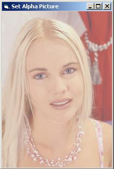



## Set Aplha Picture to Objects

### Description

to show how to set alpha picture to form objects.

[transparent picture]

Updated: i added the picture now.
 
### More Info
 

             |
---                |---
**Submitted On**   |2006-04-16 16:56:48
**By**             |[Basak Karpuz](https://github.com/Planet-Source-Code/PSCIndex/blob/master/ByAuthor/basak-karpuz.md)
**Level**          |Advanced
**User Rating**    |4.3 (13 globes from 3 users)
**Compatibility**  |VB 6\.0
**Category**       |[Windows API Call/ Explanation](https://github.com/Planet-Source-Code/PSCIndex/blob/master/ByCategory/windows-api-call-explanation__1-39.md)
**World**          |[Visual Basic](https://github.com/Planet-Source-Code/PSCIndex/blob/master/ByWorld/visual-basic.md)
**Archive File**   |[Set\_Aplha\_1988244192006\.zip](https://github.com/Planet-Source-Code/basak-karpuz-set-aplha-picture-to-objects__1-65047/archive/master.zip)

